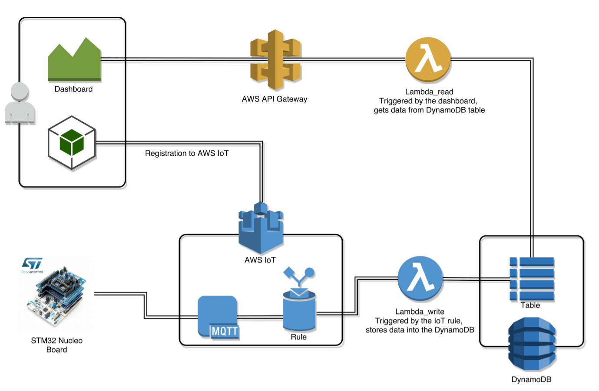

Back-end Guide
=============

This guide contains all the instructions to enable and configure the AWS services to reproduce the demo environment.
The back-end is entirely powered by [Amazon Web Services](https://aws.amazon.com/).

[TOC]
    
# Components 

- [AWS IoT](https://aws.amazon.com/iot/) is used to communicate with the Nucleo board as well as to process data coming from the device. Data is automatically processed by [AWS IoT Rules Engine](http://docs.aws.amazon.com/iot/latest/developerguide/iot-rules.html).
- [AWS Lambda](https://aws.amazon.com/lambda/) is the serverless computing component of the platform. Lambda functions (aka Lambdas) are used to process data by the IoT rules engine and to make queries on DynamoDB. 
- [Amazon DynamoDB](https://aws.amazon.com/dynamodb/) is a key-value storage where data is written by the IoT rules engine and Lambdas.
- API is powered by [Amazon API Gateway](https://aws.amazon.com/api-gateway/).
- [Amazon CloudWatch](http://aws.amazon.com/cloudwatch/) is used to store Lambda functions logs.
- [Amazon Cognito](http://aws.amazon.com/cognito/) is used for providing read-only public access to IoT functions to register new devices.
- Web dashboard is hosted on [Amazon S3](http://aws.amazon.com/s3/).

 

# Amazon DynamoDB

[DynamoDB](https://aws.amazon.com/dynamodb/) is used as a data storage. It has been configured to store incoming data from Nucleo Boards and keep them for 2 days.

## Board Data
Create board data table with the following parameters:

- Name: `nucleo-metrics`
- Primary partition key: `metric` (String)
- Primary sort key: `timestamp` (Number)

To automatically delete data older than 2 days, go to the "overview" tab of nucleo-metrics table and click on "manage TTL". 
Then insert `TTL` as attribute, and confirm.

NOTE: You can use any table names but these should be changed in Lambdas code as well.

## Auto-scaling

In the DynamoDB table page, select the "capacity" tab, and enable the auto-scaling feature both for read and write capacity. 
Set the following parameters:

`Read capacity`

- target utilization 70%
- Minimum provisioned capacity 2
- Maximum provisioned capacity 500

`Write capacity`

- target utilization 70%
- Minimum provisioned capacity 1
- Maximum provisioned capacity 40

More info about these parameters at [auto-scaling](https://docs.aws.amazon.com/amazondynamodb/latest/developerguide/AutoScaling.html).

# AWS Lambda

There are two [Lambdas](https://aws.amazon.com/lambda/) which should be set up. See the [Lambdas folder](./lambdas/) for the sources.

## Lambda Function storeNucleoDataLambda  
There is a JavaScript file for each Lambda in the folder. Open the [AWS Lambda](https://aws.amazon.com/lambda/) console and create one Lambda function for each file.

Choose "Create Lambda function" (or "Get Started Now", if it's a new AWS account).

- Select "Author from scratch"
- Give a name to the Lambda (E.g. storeNucleoDataLambda)
- Select Node.js 6.10
- Create a role with AmazonDynamoDBFullAccess policy and assing it to this Lambda
- Create Lambda function

OPTIONAL: Add CloudWatch permission to Lambda Role to enable LOGs for that Lambda.

Now the Lambda has been created but it is still empty. 
In the "Function Code", delete the existing code and copy and paste the content of JavaScript file called `storeNucleoDataLambda.js`.

In "Basic settings" set:

  - Memory: 128 MB
  - Timeout: 3 sec

Click "Save" to save the Lambda function configuration.

## Lambda Function getNucleoDataLambda  
Choose "Create Lambda function" (or "Get Started Now", if it's a new AWS account).

- Select "Author from scratch"
- Give a name to the Lambda (E.g. getNucleoDataLambda)
- Select Node.js 6.10
- Create a role with AmazonDynamoDBFullAccess policy and assing it to this Lambda
- Create Lambda function

In the "Function Code" delete the existing code and copy and paste the content of JavaScript file called `getNucleoDataLambda.js`.

In "Basic settings" set:

  - Memory: 128 MB
  - Timeout: 3 sec

Click "Save" to save the Lambda function configuration.

# AWS API Gateway
The function getNucleoDataLambda is triggered by an HTTP GET request. 
To configure this, open the API Gateway service console and do the following:

- Create a new API, put a name and a description (optional) and click on "Create API"
- Select the new API and on "Actions" select "Create new Resources"
- In the newly created resource go to "Actions" and select "Create new method"
- Select GET and confirm

To configure the method select "Method request" and in the tab "URL Query String Parameters" insert the following entries:

- TableName
- since
- board_id

For all of them, check the "required" option.

Then click on "Integration request": 

- Select "Lambda function" as integration type
- Uncheck "Use Lambda Proxy integration"
- Select a region
- Select a Lambda function to attach (getNucleoDataLambda)

In the tab "URL Query String Parameters" insert (name, mapped from):

- TableName, method.request.querystring.TableName
- since, method.request.querystring.since
- board_id, method.request.querystring.board_id

In the tab "Body Mapping Templates" select "When there are no templates defined".
Then add a mapping template, write "application/json", check that.
Clicking on "application/json", in the "generate template" menu tab, select "method request passthrough" and save it.
Finally in the "Actions" menu click on "Deploy API".

To avoid CORS issues with browser security policies select "Enable CORS" in the "Actions" menu, then deploy again the API.

# AWS IoT

[AWS IoT](https://aws.amazon.com/iot/) works as a middleware between "things" (STM32 Nucleo board in our case) and other system components.

_NOTE: This guide is based on latest interface of AWS IoT console (February 2018)._

## Policy 
Policy defines the access rules for the "thing".
In AWS IoT console, go to "Security -> Policies" and click "Create a policy".
Name it `iot_policy` and click on "Advanced mode". 
Then paste the following JSON:

```
{
    "Version": "2012-10-17",
    "Statement": [
        {
        "Effect": "Allow",
        "Action": "iot:*",
        "Resource": "*"
        }
    ]
}
```


## Rule
On AWS IoT click on Act to open the Rules tab. 
The following rule aims to call a Lambda function. 
Click "Create a rule" and set the following parameters:

- Name: ANY, i.e. `iotRule`
- Attribute: `*`
- Topic filter: (insert here the name of the MQTT topic where the Nucleo board publishes its messages) E.g.`mqttclient/prova` 
- Choose an Action: Invoke a Lambda function passing the message data and select "put_in_db_lambda"
- Click on "Add action"

After that, submit the rule by clicking the "Create rule" button.


# Amazon Cognito

[Amazon Cognito](http://aws.amazon.com/cognito/) is used to provide public access to IoT services.
In this way every user can register an IoT device (Nucleo board) without any user authentication.

Configuration here is pretty simple. Open Cognito console, go to "Manage Federated Identities" and create new identity pool. Give it any name (for example, `Nucleo Metrics`) and set the "Enable access to unauthenticated identities" checkbox. 

Along with the pool, an IAM role will be generated. 
This role will not grant access to the existing IoT topics by default. It has to be extended:

- In [Cognito](http://aws.amazon.com/cognito/) console go to the just created pool and click "Edit identity pool".
- Note the authenticated and unauthenticated role names. We will need them on the next step.
- Go to [IAM console](https://aws.amazon.com/documentation/iam/).
- Go to Roles and find roles from the previous step and do the following for both
  - Click on the role
  - Click "Create Role Policy"
  - Click "Custom Policy" then "Select"
  - Give it any name (for example, cognito-iot-publish-auth-role) and paste the following text into the "Policy Document" text area

```
{
    "Version": "2012-10-17",
    "Statement": [
    {
        "Effect": "Allow",
        "Action": [
            "iot:*"
        ],
        "Resource": [
            "*"
        ]
    }
    ]
}
```

- Click "Apply Policy"

# Dashboard configuration
To work with another AWS account, in the dashboard code some variables must be configured.
At the top of `registration.js` file set:

- AWS region
- Cognito IdentityPoolId

OPTIONAL: AWS IoT allows to group things and this feature is supported by the dashboard in the registration phase. In the AWS IoT "create a new group" option.
Then, in the registration.js file, set the groupARN and groupName as follows:

```
var params = {
			  //thingArn: 'STRING_VALUE',
			  thingGroupArn: [groupARN],
			  thingGroupName: [groupName],
			  thingName: thingName
			};
```

At the top of `refresh.js` file set:

- lambdaEndpoint (`hint`: "lambdaEndpoint" can be found in API gateway "stages" section)
- lambdaPath (`hint`: "lambdaPath" can be found in API gateway/Method/Method Request/Request Paths)


# Amazon S3

The web dashboard is a static web application which can be hosted on [Amazon S3](http://aws.amazon.com/s3/).
Upload the dashboard folder in the S3 bucket and make it public.
Then go to "Permissions", "CORS configuration" and past the following XML in the text area:

```
    <?xml version="1.0" encoding="UTF-8"?>
    <CORSConfiguration xmlns="http://s3.amazonaws.com/doc/2006-03-01/">
        <CORSRule>
            <AllowedOrigin>*</AllowedOrigin>
            <AllowedMethod>HEAD</AllowedMethod>
            <AllowedMethod>GET</AllowedMethod>
            <AllowedMethod>PUT</AllowedMethod>
            <AllowedMethod>POST</AllowedMethod>
            <AllowedMethod>DELETE</AllowedMethod>
            <ExposeHeader>ETag</ExposeHeader>
            <ExposeHeader>x-amz-meta-custom-header</ExposeHeader>
            <AllowedHeader>*</AllowedHeader>
        </CORSRule>
    </CORSConfiguration>
```


